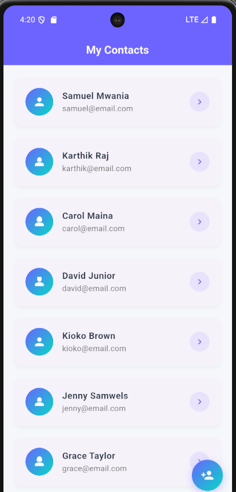
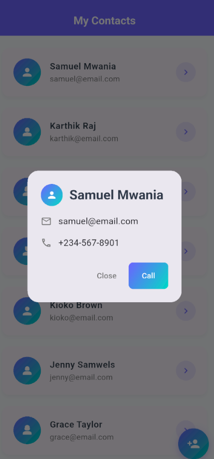

# ListView Widget Demo - Contact List

A beautiful Flutter application demonstrating the power and efficiency of ListView.builder through a real-world contact list implementation.

## 📱 App Overview

This demo showcases ListView.builder's key features:
- **Performance optimization** with on-demand widget creation
- **Memory efficiency** for large datasets
- **Smooth scrolling** with 60fps performance
- **Modern Material Design 3** aesthetics
- **Clean architecture** with separation of concerns

## ✨ Features

- 📋 **Scrollable Contact List** - Smooth scrolling through contacts
- 🎨 **Modern UI Design** - Purple gradient theme with Material Design 3
- 💬 **Interactive Details** - Tap contacts to view detailed information
- 📞 **Call Functionality** - Simulated call feature with feedback
- ➕ **Add Contact** - Floating action button for adding new contacts
- 🎯 **Responsive Design** - Optimized for mobile devices

## 🏗️ Architecture

### File Structure
```
lib/
├── main.dart                    # App entry point & theme configuration
├── models/
│   └── contact.dart            # Contact data model & sample data
├── widgets/
│   └── contact_tile.dart       # Reusable contact list item widget
└── screens/
    └── contact_list_screen.dart # Main ListView implementation
```

### Key Components

#### ListView.builder
- **Efficient rendering** - Only visible items are created
- **Memory optimization** - Widgets recycled during scrolling
- **Scalable performance** - Handles thousands of contacts smoothly

#### Material Design 3
- **Modern color scheme** - Purple (#6C63FF) and Teal (#03DAC6) gradients
- **Elevated cards** - Clean shadows and rounded corners
- **Typography hierarchy** - Clear visual information structure

## 🎯 ListView Demo Highlights

### Core ListView Properties
```dart
ListView.builder(
  itemCount: contacts.length,        // Controls list size
  padding: const EdgeInsets.all(12.0),
  itemBuilder: (context, index) {    // Creates widgets on-demand
    return ContactTile(
      contact: contacts[index],
      onTap: () => _showContactDetails(context, contacts[index]),
    );
  },
)
```

### Performance Benefits
- ✅ **Lazy Loading** - Items built only when needed
- ✅ **Viewport Rendering** - Only visible items in memory
- ✅ **Smooth Scrolling** - Native 60fps performance
- ✅ **Memory Efficient** - Automatic widget recycling

## 📸 Screenshots

### Home Screen
<!-- Add your home screen screenshot here -->


### Contact Details Dialog
<!-- Add your contact details screenshot here -->


### Scrolling Performance
<!-- Add your scrolling demonstration screenshot here -->


### Android Emulator View
<!-- Add your Android emulator screenshot here -->


## 🚀 Getting Started

### Prerequisites
- Flutter SDK (3.0.0 or higher)
- Dart SDK (2.17.0 or higher)
- Android Studio / VS Code
- Android/iOS emulator or physical device

### Installation

1. **Clone the repository**
   ```bash
   git clone <your-repository-url>
   cd listview_widget
   ```

2. **Install dependencies**
   ```bash
   flutter pub get
   ```

3. **Run the application**
   ```bash
   flutter run
   ```

### Running on Different Platforms

#### Android Emulator
```bash
flutter emulators --launch <emulator_id>
flutter run
```

#### iOS Simulator (macOS only)
```bash
flutter run
```

#### Web Browser
```bash
flutter run -d chrome
```

## 🛠️ Technical Implementation

### Widgets Used

| Widget | Purpose | Key Features |
|--------|---------|--------------|
| `ListView.builder` | Main scrollable list | On-demand rendering, performance optimization |
| `Card` | Contact item container | Material Design elevation and shadows |
| `ListTile` | Contact item layout | Standard Material Design list item |
| `AlertDialog` | Contact details popup | Modal navigation for quick information |
| `FloatingActionButton` | Add contact action | Primary action following Material Design |
| `Container` | Styling wrapper | Gradients, borders, and custom decorations |

### Navigation Patterns

- **Modal Navigation** - `showDialog()` for contact details
- **Stack Navigation** - `Navigator.pop()` for returning to list
- **Contextual Actions** - In-place interactions without losing scroll position

### Color Scheme

```dart
Primary: #6C63FF (Modern Purple)
Secondary: #03DAC6 (Teal Accent)
Background: #F5F7FA (Light Gray)
Surface: #F8F9FA (Off-white)
```

## 📚 Learning Objectives

This demo teaches:

1. **ListView.builder implementation** for performance optimization
2. **Clean architecture** with proper separation of concerns
3. **Reusable widget creation** for maintainable code
4. **Material Design 3** principles and modern UI patterns
5. **Navigation patterns** appropriate for list-based applications
6. **Performance considerations** for mobile applications

## 🎥 Presentation Points

### Key Demo Features
- **Real-world use case** - Everyone understands contact lists
- **Performance demonstration** - Smooth scrolling with immediate responsiveness
- **Interactive elements** - Contact details and call functionality
- **Clean code structure** - Easy to understand and explain
- **Modern aesthetics** - Professional appearance suitable for presentations

### Technical Talking Points
- ListView.builder vs regular ListView performance benefits
- On-demand widget creation and memory management
- Material Design 3 implementation
- Navigation pattern selection rationale
- Clean architecture and code organization

## 👨‍💻 Author

Samuel Mwania

---

**Built with Flutter 💙**
